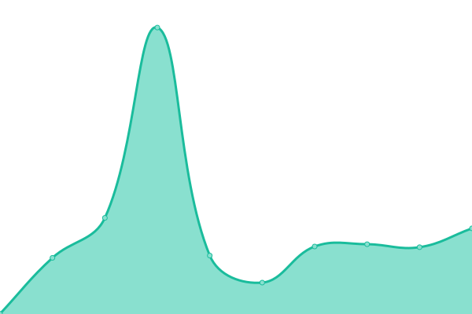

# [📈 Live Status](https://status.rachitkataria.co.in): <!--live status--> **🟥 Complete outage**

This repository contains the open-source uptime monitor and status page for [Rachit Kataria](rachitkataria.co.in), powered by [Upptime](https://github.com/upptime/upptime).

With [Upptime](https://upptime.js.org), you can get your own unlimited and free uptime monitor and status page, powered entirely by a GitHub repository. We use [Issues](https://github.com/rachitkataria13/upptime/issues) as incident reports, [Actions](https://github.com/rachitkataria13/upptime/actions) as uptime monitors, and [Pages](https://status.rachitkataria.co.in) for the status page.

<!--start: status pages-->
<!-- This summary is generated by Upptime (https://github.com/upptime/upptime) -->
<!-- Do not edit this manually, your changes will be overwritten -->
<!-- prettier-ignore -->
| URL | Status | History | Response Time | Uptime |
| --- | ------ | ------- | ------------- | ------ |
|  [Rachit Kataria - Portfolio](http://rachitkataria.co.in) | 🟥 Down | [rachit-kataria-portfolio.yml](https://github.com/rachitkataria13/upptime/commits/HEAD/history/rachit-kataria-portfolio.yml) | 

 429ms
     
 | 

<a href="https://status.rachitkataria.co.in/history/rachit-kataria-portfolio">53.56%</a>
    

|  Pet Project | 🟥 Down | [pet-project.yml](https://github.com/rachitkataria13/upptime/commits/HEAD/history/pet-project.yml) | 

 3694ms
     
 | 

<a href="https://status.rachitkataria.co.in/history/pet-project">97.30%</a>
    

<!--end: status pages-->

[**Visit our status website →**](https://status.rachitkataria.co.in)

## 📄 License

- Powered by: [Upptime](https://github.com/upptime/upptime)
- Code: [MIT](./LICENSE) © [Rachit Kataria](rachitkataria.co.in)
- Data in the `./history` directory: [Open Database License](https://opendatacommons.org/licenses/odbl/1-0/)
